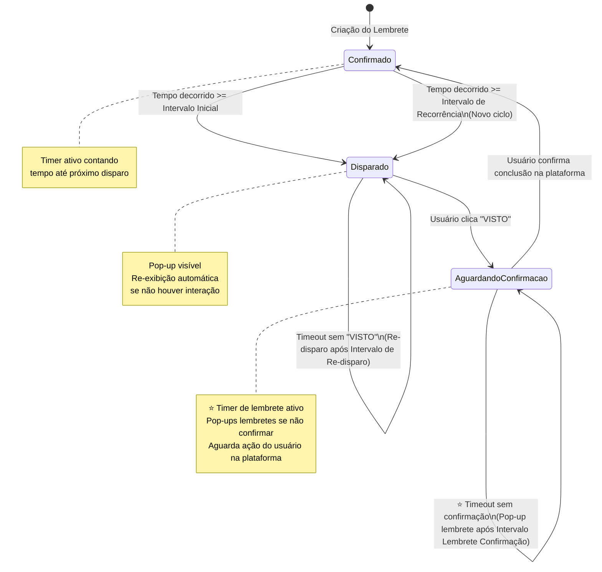

# Fluxo de Estados - Documentação Técnica

## 🔄 Diagrama de Estados Completo



---

## 📊 Tabela de Transições de Estados

| Estado Atual | Evento/Trigger | Ação do Sistema | Próximo Estado |
|--------------|----------------|-----------------|----------------|
| **CONFIRMADO** | Tempo >= Intervalo Inicial | Exibir pop-up de notificação | **DISPARADO** |
| **CONFIRMADO** | Tempo >= Intervalo de Recorrência | Exibir pop-up de notificação (novo ciclo) | **DISPARADO** |
| **DISPARADO** | Timeout sem interação | Re-exibir pop-up | **DISPARADO** (mantém) |
| **DISPARADO** | Usuário clica "VISTO" | Ocultar pop-up, registrar timestamp | **AGUARDANDO CONFIRMAÇÃO** |
| **⭐ AGUARDANDO CONFIRMAÇÃO** | **⭐ Timeout sem confirmação** | **⭐ Exibir pop-up lembrete "Confirme na plataforma!"** | **⭐ AGUARDANDO CONFIRMAÇÃO** (mantém) |
| **AGUARDANDO CONFIRMAÇÃO** | Usuário confirma na plataforma | Resetar timer, registrar confirmação | **CONFIRMADO** |

---

## ⏱️ Timers e Contadores

### Timer 1: Intervalo até Disparo
- **Ativo em**: Estado CONFIRMADO
- **Reinicia quando**: Lembrete entra em CONFIRMADO
- **Trigger**: Quando `tempo_atual >= data_ultima_confirmacao + intervalo_configurado`
- **Ação**: Transição para DISPARADO

### Timer 2: Intervalo de Re-disparo
- **Ativo em**: Estado DISPARADO
- **Reinicia quando**: Pop-up é exibido
- **Trigger**: Quando `tempo_atual >= ultima_exibicao + intervalo_redisparo`
- **Ação**: Re-exibir pop-up (mantém estado DISPARADO)

### ⭐ Timer 3: Intervalo Lembrete de Confirmação (NOVO)
- **Ativo em**: Estado AGUARDANDO CONFIRMAÇÃO
- **Reinicia quando**: Pop-up lembrete é exibido
- **Trigger**: Quando `tempo_atual >= ultima_exibicao_lembrete + intervalo_lembrete_confirmacao`
- **Ação**: Exibir pop-up lembrete "Você ainda não confirmou. Acesse a plataforma!"
- **Mantém estado**: AGUARDANDO CONFIRMAÇÃO (até confirmação manual)

---

## 🎬 Cenários de Uso Detalhados

### Cenário 1: Fluxo Normal (Usuário Atento)

```
┌─────────────────────────────────────────────────────────────┐
│ LINHA DO TEMPO                                              │
├─────────────────────────────────────────────────────────────┤
│                                                             │
│ T0: Criação/Confirmação                                     │
│     Estado: CONFIRMADO                                      │
│     Timer: Inicia contagem (Intervalo Inicial = 2h)        │
│                                                             │
│ T0 + 2h: Timer alcançado                                    │
│     Estado: CONFIRMADO → DISPARADO                          │
│     Ação: Pop-up exibido                                    │
│     Timer: Inicia contagem re-disparo (5min)               │
│                                                             │
│ T0 + 2h + 30s: Usuário vê pop-up                           │
│     Ação: Clica "VISTO"                                     │
│     Estado: DISPARADO → AGUARDANDO CONFIRMAÇÃO             │
│     Timer: Parado                                           │
│                                                             │
│ T0 + 2h + 5min: Usuário acessa plataforma                  │
│     Ação: Confirma conclusão da atividade                  │
│     Estado: AGUARDANDO CONFIRMAÇÃO → CONFIRMADO            │
│     Timer: Reinicia (Intervalo Recorrência = 24h)         │
│                                                             │
│ T0 + 26h: Novo ciclo inicia                                │
│     Estado: CONFIRMADO → DISPARADO                          │
│     Ação: Novo pop-up exibido                              │
│                                                             │
└─────────────────────────────────────────────────────────────┘
```

---

### Cenário 2: Usuário Ignora Pop-up (Re-disparos)

```
┌─────────────────────────────────────────────────────────────┐
│ LINHA DO TEMPO                                              │
├─────────────────────────────────────────────────────────────┤
│                                                             │
│ T0 + 2h: Timer alcançado                                    │
│     Estado: CONFIRMADO → DISPARADO                          │
│     Ação: Pop-up exibido (1ª vez)                          │
│     Timer Re-disparo: 5min                                  │
│                                                             │
│ T0 + 2h + 5min: Sem interação                              │
│     Estado: DISPARADO (mantém)                             │
│     Ação: Pop-up re-exibido (2ª vez)                       │
│     Timer Re-disparo: Reinicia (5min)                      │
│                                                             │
│ T0 + 2h + 10min: Sem interação                             │
│     Estado: DISPARADO (mantém)                             │
│     Ação: Pop-up re-exibido (3ª vez)                       │
│     Timer Re-disparo: Reinicia (5min)                      │
│                                                             │
│ T0 + 2h + 12min: Usuário clica "VISTO"                     │
│     Estado: DISPARADO → AGUARDANDO CONFIRMAÇÃO             │
│     Ação: Pop-up oculto                                     │
│     Timer: Parado                                           │
│                                                             │
│ T0 + 2h + 30min: Usuário confirma                          │
│     Estado: AGUARDANDO CONFIRMAÇÃO → CONFIRMADO            │
│                                                             │
└─────────────────────────────────────────────────────────────┘
```

---

### ⭐ Cenário 3: Usuário Não Confirma (Com Lembretes de Confirmação - NOVO)

```
┌─────────────────────────────────────────────────────────────┐
│ LINHA DO TEMPO                                              │
├─────────────────────────────────────────────────────────────┤
│                                                             │
│ T0 + 2h: Pop-up exibido                                     │
│     Estado: DISPARADO                                       │
│                                                             │
│ T0 + 2h + 1min: Usuário clica "VISTO"                      │
│     Estado: AGUARDANDO CONFIRMAÇÃO                         │
│     Timer: Inicia contagem lembrete (30min)                │
│                                                             │
│ T0 + 2h + 31min: Usuário NÃO confirmou                     │
│     Estado: AGUARDANDO CONFIRMAÇÃO (mantém)                │
│     Ação: Pop-up lembrete exibido (1ª vez)                 │
│     Mensagem: "Você ainda não confirmou. Acesse plataforma!"│
│     Timer: Reinicia (30min)                                 │
│                                                             │
│ T0 + 3h + 1min: Usuário NÃO confirmou                      │
│     Estado: AGUARDANDO CONFIRMAÇÃO (mantém)                │
│     Ação: Pop-up lembrete re-exibido (2ª vez)              │
│     Timer: Reinicia (30min)                                 │
│                                                             │
│ T0 + 3h + 31min: Usuário NÃO confirmou                     │
│     Estado: AGUARDANDO CONFIRMAÇÃO (mantém)                │
│     Ação: Pop-up lembrete re-exibido (3ª vez)              │
│     Timer: Reinicia (30min)                                 │
│                                                             │
│ T0 + 4h: Usuário finalmente acessa plataforma              │
│     Estado: AGUARDANDO CONFIRMAÇÃO (ainda)                 │
│     Ação: Lista de pendentes mostra este lembrete          │
│     Usuário: Confirma conclusão                            │
│     Estado: AGUARDANDO CONFIRMAÇÃO → CONFIRMADO            │
│     Timer: Para                                             │
│                                                             │
│ T0 + 28h: Novo ciclo                                        │
│     Estado: CONFIRMADO → DISPARADO                          │
│                                                             │
└─────────────────────────────────────────────────────────────┘
```

**⭐ Novidade**: Agora há re-disparos de lembretes no estado AGUARDANDO CONFIRMAÇÃO até o usuário confirmar na plataforma.

---

### Cenário 4: Usuário Ignora Tudo (Máximo Re-disparos)

```
┌─────────────────────────────────────────────────────────────┐
│ LINHA DO TEMPO - PIOR CENÁRIO                              │
├─────────────────────────────────────────────────────────────┤
│                                                             │
│ 10:00 - CONFIRMADO → DISPARADO                              │
│         Pop-up: "Faça atividade" (1ª vez)                  │
│                                                             │
│ 10:05 - Re-disparo (2ª vez) - usuário ignora               │
│ 10:10 - Re-disparo (3ª vez) - usuário ignora               │
│ 10:15 - Re-disparo (4ª vez) - usuário ignora               │
│                                                             │
│ 10:20 - Usuário finalmente clica "VISTO"                   │
│         DISPARADO → AGUARDANDO CONFIRMAÇÃO                  │
│         Timer lembrete: inicia (30 min)                     │
│                                                             │
│ 10:50 - Pop-up lembrete: "Confirme na plataforma!" (1ª vez)│
│         Usuário clica OK mas não acessa plataforma          │
│                                                             │
│ 11:20 - Pop-up lembrete (2ª vez) - usuário ignora          │
│ 11:50 - Pop-up lembrete (3ª vez) - usuário ignora          │
│ 12:20 - Pop-up lembrete (4ª vez) - usuário ignora          │
│                                                             │
│ 12:30 - Usuário FINALMENTE acessa plataforma e confirma    │
│         AGUARDANDO CONFIRMAÇÃO → CONFIRMADO                 │
│                                                             │
│ Total de pop-ups: 4 (DISPARADO) + 4 (AGUARDANDO) = 8       │
│ Tempo total: 2h30min desde primeiro disparo                │
│                                                             │
└─────────────────────────────────────────────────────────────┘
```

---

## 🔍 Detalhamento por Estado

### 🟢 Estado: CONFIRMADO

**Características**:
- Estado "quieto" - sem interação com usuário
- Timer ativo em background
- Verificação periódica do timestamp

**Dados Armazenados**:
```typescript
{
  id: string;
  status: "CONFIRMADO";
  dataUltimaConfirmacao: Date;
  proximoDisparo: Date; // calculado
  intervaloInicial: number; // em minutos
  intervaloRecorrencia: number; // em minutos
}
```

**Lógica de Verificação**:
```typescript
if (Date.now() >= proximoDisparo) {
  transition_to_DISPARADO();
}
```

---

### 🔴 Estado: DISPARADO

**Características**:
- Pop-up visível para o usuário
- Re-exibição automática se ignorado
- Timer de re-disparo ativo

**Dados Armazenados**:
```typescript
{
  id: string;
  status: "DISPARADO";
  dataDisparo: Date;
  ultimaExibicao: Date;
  numeroExibicoes: number; // contador
  intervaloRedisparo: number; // em minutos
}
```

**Lógica de Re-disparo**:
```typescript
if (Date.now() >= ultimaExibicao + intervaloRedisparo) {
  reexibir_popup();
  numeroExibicoes++;
  ultimaExibicao = Date.now();
}
```

**Interação do Usuário**:
```typescript
on_visto_clicked() {
  dataVisto = Date.now();
  transition_to_AGUARDANDO_CONFIRMACAO();
  hide_popup();
}
```

---

### 🟡 Estado: AGUARDANDO CONFIRMAÇÃO

**⭐ Características (ATUALIZADAS)**:
- **⭐ Timer de lembrete ativo** (NOVO!)
- **⭐ Pop-ups lembretes** se usuário não confirmar
- Aguarda ação do usuário na plataforma
- Visível em lista de pendências

**⭐ Dados Armazenados (ATUALIZADOS)**:
```typescript
{
  id: string;
  status: "AGUARDANDO_CONFIRMACAO";
  dataVisto: Date;
  pendente: boolean; // true

  // ⭐ NOVOS CAMPOS:
  ultimaExibicaoLembrete: Date?;
  numeroExibicoesLembrete: number; // contador de lembretes
  intervaloLembreteConfirmacao: number; // em minutos
}
```

**⭐ Lógica de Re-disparo de Lembretes (NOVO)**:
```typescript
// Verificar se deve exibir lembrete
if (Date.now() >= ultimaExibicaoLembrete + intervaloLembreteConfirmacao) {
  exibir_popup_lembrete("Você ainda não confirmou. Acesse a plataforma!");
  numeroExibicoesLembrete++;
  ultimaExibicaoLembrete = Date.now();
  // Mantém estado AGUARDANDO_CONFIRMACAO
}
```

**Interação do Usuário**:
```typescript
// Quando usuário confirma na plataforma
on_confirmar_conclusao() {
  dataUltimaConfirmacao = Date.now();
  proximoDisparo = Date.now() + intervaloRecorrencia;

  // ⭐ Limpar contadores de lembrete
  ultimaExibicaoLembrete = null;
  numeroExibicoesLembrete = 0;

  transition_to_CONFIRMADO();
  registrar_historico();
}
```

---

## 🎯 Regras de Negócio

### RN-01: Inicialização
- Todo lembrete criado inicia no estado **CONFIRMADO**
- `dataUltimaConfirmacao` = data de criação
- `proximoDisparo` = data de criação + intervalo inicial

### RN-02: Transição Automática
- CONFIRMADO → DISPARADO é **automática** (baseada em tempo)
- Sistema deve verificar periodicamente (a cada 1 minuto, por exemplo)

### RN-03: Re-disparo Ilimitado
- Enquanto em estado DISPARADO, pop-ups continuam sendo exibidos
- **Sem limite** de número de re-exibições
- Continua até usuário clicar "VISTO"

### ⭐ RN-04: Re-disparo de Lembretes de Confirmação (NOVO)
- Enquanto em estado AGUARDANDO CONFIRMAÇÃO, pop-ups lembretes são exibidos periodicamente
- Intervalo configurável (ex: 30 minutos)
- **Sem limite** de número de lembretes
- Continua até usuário confirmar na plataforma

### RN-05: Sem Timeout de Confirmação
- Estado AGUARDANDO CONFIRMAÇÃO **não expira**
- Usuário pode confirmar a qualquer momento (minutos, horas, dias depois)
- Pop-ups lembretes continuam aparecendo até confirmação

### RN-06: Ciclo Contínuo
- Após confirmação, lembrete volta para CONFIRMADO
- Novo ciclo inicia automaticamente após intervalo de recorrência
- Lembretes não têm "fim" - ciclo infinito

### RN-07: Configurações Independentes
- Cada lembrete pode ter intervalos diferentes (agora 4 intervalos)
- Intervalos configurados no momento da criação
- Podem ser editados posteriormente

---

## 🚨 Casos Especiais

### Caso 1: Sistema Offline
**Problema**: Servidor offline durante horário de disparo

**Solução**:
- Ao voltar online, verificar todos os lembretes
- Disparar imediatamente se `proximoDisparo < agora`
- Registrar atraso no log

---

### Caso 2: Múltiplos Lembretes Simultâneos
**Problema**: Vários lembretes disparam ao mesmo tempo

**Solução**:
- Exibir pop-ups sequencialmente (não sobrepor)
- Ou exibir lista de múltiplas atividades em único pop-up
- Usuário marca "VISTO" individualmente ou em lote

---

### Caso 3: Edição Durante Ciclo
**Problema**: Usuário edita intervalo de lembrete já em execução

**Solução**:
- Se estado = CONFIRMADO: Recalcular `proximoDisparo`
- Se estado = DISPARADO: Não afetar ciclo atual, aplicar no próximo
- Se estado = AGUARDANDO: Aplicar no próximo ciclo

---

### Caso 4: Exclusão de Lembrete
**Problema**: Usuário quer deletar lembrete

**Solução**:
- Permitir exclusão em qualquer estado
- Se DISPARADO: Ocultar pop-up imediatamente
- **⭐ Se AGUARDANDO**: Ocultar pop-ups lembretes também
- Confirmar ação (evitar deleção acidental)
- Possibilidade de "pausar" ao invés de deletar

---

## ✅ Checklist de Implementação

- [ ] Enum de estados (CONFIRMADO, DISPARADO, AGUARDANDO_CONFIRMACAO)
- [ ] Modelo de dados com todos os campos necessários (incluindo novos campos de lembrete)
- [ ] Timer/Scheduler para verificação periódica
- [ ] Lógica de transição entre estados
- [ ] Sistema de exibição de pop-ups (atividade)
- [ ] **⭐ Sistema de exibição de pop-ups lembretes** (NOVO)
- [ ] API para clicar "VISTO"
- [ ] **⭐ Lógica de re-disparo de lembretes no estado AGUARDANDO** (NOVO)
- [ ] Interface de confirmação na plataforma
- [ ] Listagem de lembretes por estado
- [ ] Histórico de ações (opcional)
- [ ] Testes de fluxo completo (incluindo re-disparos em ambos estados)

---

## 📅 Controle de Versão
- **Versão**: 1.0
- **Data**: 10/12/2025
- **Status**: Documentação inicial aprovada

- **Versão**: 1.1
- **Data**: 10/12/2025
- **Status**: Adicionado 4º intervalo e sistema de lembretes de confirmação no estado AGUARDANDO
