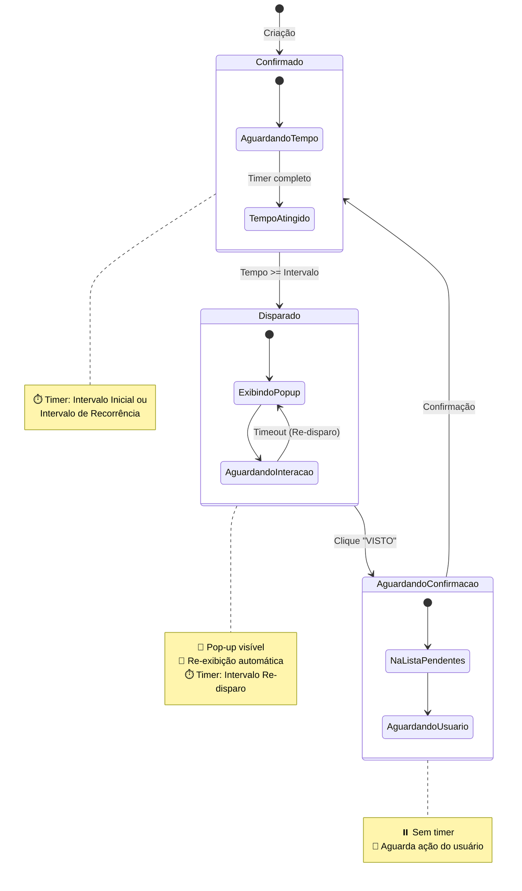

# Diagramas Visuais - Sistema de Lembretes

## 🔄 Diagrama de Ciclo Completo

```
┌─────────────────────────────────────────────────────────────────────────┐
│                         CICLO DE VIDA DO LEMBRETE                       │
└─────────────────────────────────────────────────────────────────────────┘

     [CRIAÇÃO]
         │
         ▼
    ┌────────────────┐
    │  🟢 CONFIRMADO │ ◄──────────────────────────┐
    │                │                            │
    │  Aguardando... │                            │
    │  Timer ativo   │                            │
    └────────────────┘                            │
         │                                        │
         │ Tempo >= Intervalo                     │
         │                                        │
         ▼                                        │
    ┌────────────────┐                            │
    │  🔴 DISPARADO  │                            │
    │                │                            │
    │  Pop-up ativo  │ ◄──────┐                  │
    │  Visível       │        │                  │
    └────────────────┘        │                  │
         │                    │                  │
         │ Usuário clica      │ Timeout          │
         │ "VISTO"            │ sem interação    │
         │                    │                  │
         │                    └──────────────────┘
         │                      (Re-disparo)
         ▼
    ┌────────────────┐
    │  🟡 AGUARDANDO │
    │   CONFIRMAÇÃO  │
    │                │
    │  Pendente      │
    └────────────────┘
         │
         │ Usuário confirma
         │ na plataforma
         │
         └───────────────────────────────────────┘

```

---

## 📊 Diagrama de Estados (Formal)



---

## 🕐 Linha do Tempo - Exemplo Prático

```
CONFIGURAÇÃO DO LEMBRETE:
- Intervalo Inicial: 2 horas
- Intervalo Recorrência: 24 horas
- Intervalo Re-disparo: 5 minutos
Atividade: "Revisar relatório de vendas"

┌─────────────────────────────────────────────────────────────────────────┐
│                          LINHA DO TEMPO                                 │
├─────────────────────────────────────────────────────────────────────────┤
│                                                                         │
│  08:00  │ [CRIADO] Estado: CONFIRMADO                                  │
│         │ Próximo disparo: 10:00                                       │
│         │ ⏳ Timer iniciado...                                         │
│         │                                                              │
│  09:00  │ ⏳ Aguardando... (1h restante)                               │
│         │                                                              │
│  10:00  │ ⏰ [DISPARO AUTOMÁTICO]                                      │
│         │ Estado: CONFIRMADO → DISPARADO                               │
│         │ 🔔 Pop-up exibido (1ª vez)                                   │
│         │ Usuário não viu...                                           │
│         │                                                              │
│  10:05  │ 🔔 Pop-up RE-EXIBIDO (2ª vez)                                │
│         │ Usuário não viu...                                           │
│         │                                                              │
│  10:10  │ 🔔 Pop-up RE-EXIBIDO (3ª vez)                                │
│         │ Usuário ainda não viu...                                     │
│         │                                                              │
│  10:12  │ 👁️ Usuário vê pop-up e clica "VISTO"                        │
│         │ Estado: DISPARADO → AGUARDANDO CONFIRMAÇÃO                   │
│         │ Pop-up oculto                                                │
│         │ Adicionado à lista de pendentes                              │
│         │                                                              │
│  10:15  │ ⏸️ Aguardando... (na lista de pendentes)                     │
│         │                                                              │
│  10:30  │ 👤 Usuário acessa plataforma                                 │
│         │ Vê lista de pendentes                                        │
│         │ Clica "CONFIRMAR"                                            │
│         │ Estado: AGUARDANDO CONFIRMAÇÃO → CONFIRMADO                  │
│         │ Próximo disparo: 10:30 + 24h = 10:30 (dia seguinte)        │
│         │ ⏳ Novo timer iniciado                                       │
│         │                                                              │
│  [DIA SEGUINTE]                                                         │
│  10:30  │ ⏰ [NOVO DISPARO] Estado: CONFIRMADO → DISPARADO             │
│         │ 🔔 Pop-up exibido novamente                                  │
│         │ Ciclo reinicia...                                            │
│         │                                                              │
└─────────────────────────────────────────────────────────────────────────┘
```

---

## 🖥️ Fluxo de Telas do Usuário

```
┌───────────────────────────────────────────────────────────────┐
│                    JORNADA DO USUÁRIO                         │
└───────────────────────────────────────────────────────────────┘

1️⃣ CRIAÇÃO
   ┌─────────────────────┐
   │  📝 Formulário      │
   │  ┌───────────────┐  │
   │  │ Título        │  │
   │  │ Descrição     │  │
   │  │ Prioridade: ▼ │  │
   │  ├───────────────┤  │
   │  │ ⏱️ Intervalos │  │
   │  │ Inicial: [2h] │  │
   │  │ Recorrê: [1d] │  │
   │  │ Redisp.: [5m] │  │
   │  ├───────────────┤  │
   │  │  [ SALVAR ]   │  │
   │  └───────────────┘  │
   └─────────────────────┘
            │
            ▼
2️⃣ LISTAGEM
   ┌─────────────────────────────────────┐
   │  📋 Meus Lembretes                  │
   │  ┌─────────────────────────────┐    │
   │  │ [Filtros] [Busca]           │    │
   │  ├─────────────────────────────┤    │
   │  │ 🟢 Revisar relatório        │    │
   │  │    Próx: 10:00 (2h)         │    │
   │  │    [Editar] [Pausar]        │    │
   │  ├─────────────────────────────┤    │
   │  │ 🟡 Ligar para cliente       │    │
   │  │    Aguardando confirmação   │    │
   │  │    [Confirmar]              │    │
   │  └─────────────────────────────┘    │
   └─────────────────────────────────────┘
            │
            ▼
3️⃣ NOTIFICAÇÃO (Sistema dispara)
   ┌──────────────────────────┐
   │  🔔 LEMBRETE - URGENTE   │
   │  ┌────────────────────┐  │
   │  │                    │  │
   │  │ Revisar relatório  │  │
   │  │ de vendas          │  │
   │  │                    │  │
   │  │ Verificar números  │  │
   │  │ do mês             │  │
   │  │                    │  │
   │  │   [  VISTO  ]      │  │
   │  │                    │  │
   │  └────────────────────┘  │
   └──────────────────────────┘
            │ (clique)
            ▼
4️⃣ PENDENTES
   ┌─────────────────────────────────────┐
   │  ⏳ Atividades Pendentes  (1)       │
   │  ┌─────────────────────────────┐    │
   │  │ ✓ Revisar relatório         │    │
   │  │   Visto em: 10:12           │    │
   │  │   Há 18 minutos             │    │
   │  │   ┌─────────────┐           │    │
   │  │   │ CONFIRMAR   │           │    │
   │  │   └─────────────┘           │    │
   │  └─────────────────────────────┘    │
   └─────────────────────────────────────┘
            │ (clique)
            ▼
5️⃣ CONFIRMADO
   ┌─────────────────────────────────────┐
   │  ✅ Atividade confirmada!           │
   │                                     │
   │  "Revisar relatório de vendas"     │
   │                                     │
   │  Próximo disparo:                  │
   │  Amanhã às 10:30                   │
   │                                     │
   └─────────────────────────────────────┘
```

---

## 🎯 Arquitetura de Componentes

```
┌───────────────────────────────────────────────────────────────┐
│                    ARQUITETURA DO SISTEMA                     │
└───────────────────────────────────────────────────────────────┘

┌─────────────────────────────────────────────────────────────┐
│                       FRONTEND (Next.js)                     │
├─────────────────────────────────────────────────────────────┤
│                                                             │
│  ┌──────────────┐  ┌──────────────┐  ┌─────────────────┐  │
│  │  Páginas     │  │ Componentes  │  │ Hooks           │  │
│  │              │  │              │  │                 │  │
│  │ /lembretes   │  │ LembreteForm │  │ useLembretes    │  │
│  │ /pendentes   │  │ LembreteCard │  │ useNotification │  │
│  │ /dashboard   │  │ PopupNotif   │  │ useScheduler    │  │
│  └──────────────┘  └──────────────┘  └─────────────────┘  │
│                                                             │
│  ┌──────────────────────────────────────────────────────┐  │
│  │              State Management (React Query)          │  │
│  └──────────────────────────────────────────────────────┘  │
│                           │                                 │
└───────────────────────────┼─────────────────────────────────┘
                            │
                            ▼ (HTTP/Server Actions)
┌─────────────────────────────────────────────────────────────┐
│                    BACKEND (Next.js API)                     │
├─────────────────────────────────────────────────────────────┤
│                                                             │
│  ┌──────────────┐  ┌──────────────┐  ┌─────────────────┐  │
│  │ API Routes   │  │ Server       │  │ Services        │  │
│  │              │  │ Actions      │  │                 │  │
│  │ GET /api/... │  │              │  │ NotificationSvc │  │
│  │ POST /api/...│  │ createAction │  │ SchedulerSvc    │  │
│  │ PUT /api/... │  │ updateAction │  │                 │  │
│  └──────────────┘  └──────────────┘  └─────────────────┘  │
│                           │                                 │
│                           ▼                                 │
│  ┌──────────────────────────────────────────────────────┐  │
│  │                 Prisma ORM                           │  │
│  └──────────────────────────────────────────────────────┘  │
│                           │                                 │
└───────────────────────────┼─────────────────────────────────┘
                            │
                            ▼ (SQL)
┌─────────────────────────────────────────────────────────────┐
│                     DATABASE (PostgreSQL)                    │
├─────────────────────────────────────────────────────────────┤
│                                                             │
│  ┌──────────────┐  ┌──────────────┐  ┌─────────────────┐  │
│  │  Lembrete    │  │  Historico   │  │  User           │  │
│  │              │  │  Lembrete    │  │                 │  │
│  │  (tabela)    │  │  (tabela)    │  │  (existente)    │  │
│  └──────────────┘  └──────────────┘  └─────────────────┘  │
│                                                             │
└─────────────────────────────────────────────────────────────┘

┌─────────────────────────────────────────────────────────────┐
│                    SCHEDULER (Background)                    │
├─────────────────────────────────────────────────────────────┤
│                                                             │
│  ┌──────────────────────────────────────────────────────┐  │
│  │  Cron Job (a cada 1 minuto)                         │  │
│  │  ├─ Verificar lembretes CONFIRMADO                  │  │
│  │  ├─ Verificar lembretes DISPARADO (re-disparo)      │  │
│  │  └─ Disparar notificações                           │  │
│  └──────────────────────────────────────────────────────┘  │
│                                                             │
└─────────────────────────────────────────────────────────────┘

┌─────────────────────────────────────────────────────────────┐
│                 NOTIFICATION SYSTEM                          │
├─────────────────────────────────────────────────────────────┤
│                                                             │
│  ┌──────────────┐  ┌──────────────┐  ┌─────────────────┐  │
│  │ Browser      │  │ In-App       │  │ Email           │  │
│  │ Notification │  │ Toast        │  │ (opcional)      │  │
│  │ API          │  │              │  │                 │  │
│  └──────────────┘  └──────────────┘  └─────────────────┘  │
│                                                             │
└─────────────────────────────────────────────────────────────┘
```

---

## 📦 Estrutura de Dados Visual

```
┌─────────────────────────────────────────────────────────────┐
│                        LEMBRETE                             │
├─────────────────────────────────────────────────────────────┤
│                                                             │
│  ID: clm123abc456                                           │
│  ┌───────────────────────────────────────────────────┐      │
│  │  INFORMAÇÕES BÁSICAS                              │      │
│  │  • Título: "Revisar relatório"                    │      │
│  │  • Descrição: "Verificar números..."              │      │
│  │  • Prioridade: ALTA 🔴                            │      │
│  │  • Ativo: ✅ SIM                                  │      │
│  └───────────────────────────────────────────────────┘      │
│                                                             │
│  ┌───────────────────────────────────────────────────┐      │
│  │  ESTADO                                           │      │
│  │  Status: 🟢 CONFIRMADO                            │      │
│  └───────────────────────────────────────────────────┘      │
│                                                             │
│  ┌───────────────────────────────────────────────────┐      │
│  │  CONFIGURAÇÕES DE TEMPO                           │      │
│  │  • Intervalo Inicial: 120 min (2h)                │      │
│  │  • Intervalo Recorrência: 1440 min (1 dia)        │      │
│  │  • Intervalo Re-disparo: 5 min                    │      │
│  └───────────────────────────────────────────────────┘      │
│                                                             │
│  ┌───────────────────────────────────────────────────┐      │
│  │  TIMESTAMPS                                       │      │
│  │  • Criado em: 2025-12-10 08:00                    │      │
│  │  • Última confirmação: 2025-12-10 10:30           │      │
│  │  • Próximo disparo: 2025-12-11 10:30             │      │
│  │  • Disparo: null                                  │      │
│  │  • Visto: null                                    │      │
│  └───────────────────────────────────────────────────┘      │
│                                                             │
│  ┌───────────────────────────────────────────────────┐      │
│  │  CONTROLE                                         │      │
│  │  • Nº Exibições: 0                                │      │
│  │  • Última Exibição: null                          │      │
│  └───────────────────────────────────────────────────┘      │
│                                                             │
│  ┌───────────────────────────────────────────────────┐      │
│  │  RELACIONAMENTOS                                  │      │
│  │  • User ID: user_789xyz                           │      │
│  │  • Histórico: [3 entradas]                        │      │
│  └───────────────────────────────────────────────────┘      │
│                                                             │
└─────────────────────────────────────────────────────────────┘
```

---

## 🔔 Fluxo de Notificação Detalhado

```
┌───────────────────────────────────────────────────────────────┐
│            COMO FUNCIONA O SISTEMA DE NOTIFICAÇÃO             │
└───────────────────────────────────────────────────────────────┘

1. SCHEDULER VERIFICA (A cada 1 minuto)
   ┌─────────────────────────────────┐
   │  Buscar lembretes WHERE:        │
   │  • status = CONFIRMADO          │
   │  • ativo = true                 │
   │  • proximoDisparo <= AGORA      │
   └─────────────────────────────────┘
             │
             ▼ (Encontrou lembretes)

2. PARA CADA LEMBRETE ENCONTRADO
   ┌─────────────────────────────────┐
   │  Atualizar banco:               │
   │  • status = DISPARADO           │
   │  • dataDisparo = AGORA          │
   │  • numeroExibicoes = 1          │
   │  • ultimaExibicao = AGORA       │
   │                                 │
   │  Criar histórico:               │
   │  • acao = "disparado"           │
   │  • estadoAnterior = CONFIRMADO  │
   │  • estadoNovo = DISPARADO       │
   └─────────────────────────────────┘
             │
             ▼

3. DISPARAR NOTIFICAÇÃO
   ┌──────────────────────────────────────┐
   │  A. Tentar Notification API          │
   │     (browser nativo)                 │
   │                                      │
   │     ┌────────────────────────┐       │
   │     │  🔔 Windows/Mac/Linux  │       │
   │     │  Notificação nativa    │       │
   │     │  [Visto]               │       │
   │     └────────────────────────┘       │
   │           │                          │
   │           ▼ (Se permissão negada)    │
   │                                      │
   │  B. Fallback: Toast In-App           │
   │     (dentro da aplicação)            │
   │                                      │
   │     ┌────────────────────────┐       │
   │     │  🔔 Toast flutuante    │       │
   │     │  [Visto]               │       │
   │     └────────────────────────┘       │
   └──────────────────────────────────────┘
             │
             ▼

4. USUÁRIO INTERAGE
   ┌─────────────────────────────────┐
   │  Clica "VISTO"                  │
   │    ↓                            │
   │  POST /api/lembretes/[id]/visto │
   │    ↓                            │
   │  Atualizar:                     │
   │  • status = AGUARDANDO_CONF     │
   │  • dataVisto = AGORA            │
   │    ↓                            │
   │  Ocultar notificação            │
   └─────────────────────────────────┘
             │
             ▼

5. LISTA DE PENDENTES
   ┌─────────────────────────────────┐
   │  Badge no header: (1)           │
   │  Lembrete adicionado à lista    │
   │                                 │
   │  Usuário acessa /pendentes      │
   │  Clica "CONFIRMAR"              │
   │    ↓                            │
   │  POST /api/.../confirmar        │
   │    ↓                            │
   │  Atualizar:                     │
   │  • status = CONFIRMADO          │
   │  • dataUltimaConf = AGORA       │
   │  • proximoDisparo = AGORA + 24h │
   └─────────────────────────────────┘
             │
             ▼

6. NOVO CICLO INICIA
   ┌─────────────────────────────────┐
   │  Lembrete volta para estado     │
   │  CONFIRMADO                     │
   │                                 │
   │  Scheduler aguarda 24h...       │
   │                                 │
   │  Volta ao passo 1               │
   └─────────────────────────────────┘
```

---

## 📅 Controle
- **Versão**: 1.0
- **Data**: 10/12/2025
- **Tipo**: Documentação Visual

- **Versão**: 1.1
- **Data**: 10/12/2025
- **Tipo**: Adicionado fluxo de lembretes de confirmação (4º intervalo) no estado AGUARDANDO
